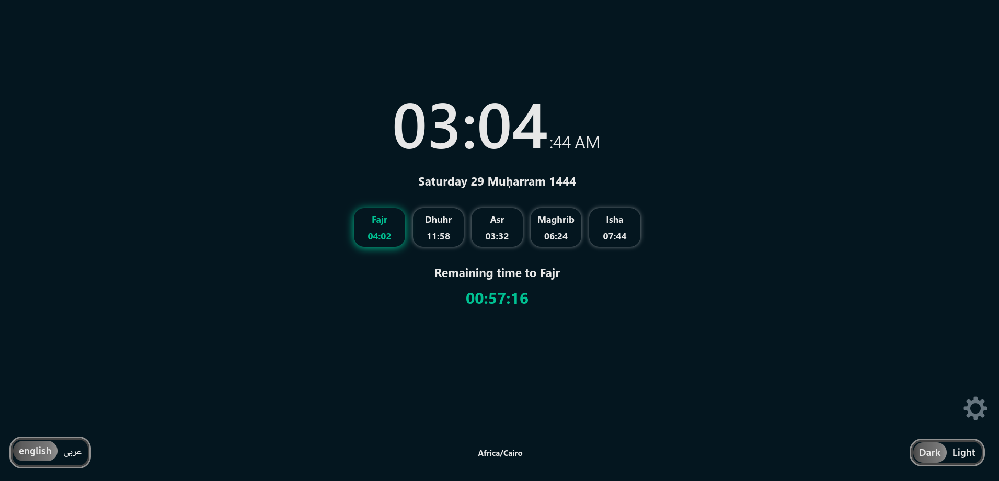

# [Islamic Prayer Times](https://m-hafez22.github.io/islamic-prayer-times/)

[](https://addons.mozilla.org/en-US/firefox/addon/islamic-prayer-times/)
[](https://addons.mozilla.org/en-US/firefox/addon/islamic-prayer-times/)
[](https://addons.mozilla.org/en-US/firefox/addon/islamic-prayer-times/)

[](https://hub.docker.com/r/mohamedhafez/islamic_prayer_times)

A web Application that provides You with **Hijri Date**, **Prayer Times**, and **The Remaining Time to the next prayer** depending on your time zone.

Go to [Islamic Prayer Times](https://m-hafez22.github.io/islamic-prayer-times/)



## Table of Contents

- [General info](#general-info)
- [Features](#features)
- [Manual](#manual)
- [Clone](#clone)
- [Extension](#extension)
- [Inspiration](#inspiration)
- [License](#license)

## General info

Islamic Prayer Times is a web app that uses **[AlAdhan.com](https://aladhan.com/prayer-times-api)** API to provide the user with **Hijri date**, **Prayers times**, and **The Remaining Time to the next pray**

> The browser tab icon from [flaticon](https://www.flaticon.com) made by [kerismaker](https://www.flaticon.com/authors/kerismaker)

## Features

1. Current time ( in 12 formats)
2. Hijri Date
3. The prayers times for one day
4. Remaining time for the next prayer

## Manual

- Switching language
  1. Press the gear icon on the bottom right corner.
  2. The languages will appear in the bottom left corner.
  3. Press the button of your language.

- Switching Theme
  1. Press the gear icon on the bottom right corner.
  2. The Themes will appear in the bottom right corner.
  3. Press the button of your Theme.

- Location
  - let the app detect your location to present prayer times for your Time zone.
  - If you block location detecting it will present data for the default location ( Africa/Cairo ).
  
  - To check the used time zone *press the gear icon on the bottom right* corner The time zone will be displayed at the bottom of the app

## Clone

To clone and run this application, you'll need Git and npm (which comes with Node.js) installed on your computer.
From your command line:

1. Clone this repository
  `git clone https://github.com/M-Hafez22/islamic-prayer-times.git`
2. Go into the repository
  `cd islamic-prayer-times`
3. Install dependencies
  `npm install`
4. Run the app
  `npm start`
5. when it opens in your browser it will ask for detecting your location choose *Allow*

## Extension

> It's available on Mozilla Add-ons as [Islamic Prayer Times](https://addons.mozilla.org/en-US/firefox/addon/islamic-prayer-times/)

### Build for firefox

- Open [package.json](./package.json) and make sure that **homepage** set to **.** the current directory

  ```json
  "homepage": "."
  ```

- Open [manifest.json](./public/manifest.json) in the public directory and make sure that **manifest_version** is set to **2**

  ```json
  "manifest_version": 2,
  ```

- Now run buildextension script

  ```bash
  npm run buildextension
  ```

### Build for Chrome

- Open [package.json](./package.json) and make sure that **homepage** set to **.** the current directory

  ```json
  "homepage": "."
  ```

- Open [manifest.json](./public/manifest.json) in the public directory and make sure that **manifest_version** is set to **3**

  ```json
  "manifest_version": 3,
  ```

- Now run buildextension script

  ```bash
  npm run buildextension
  ```

## Inspiration

- This project was inspired by a chrome extension called **[Islamway Ramadan | طريق الإسلام](https://chrome.google.com/webstore/detail/islamway-ramadan-%D8%B7%D8%B1%D9%8A%D9%82-%D8%A7%D9%84%D8%A5/mcbgkoikidgnmbekipnnhhhjhcaioflb)** which is powered by **[Islamway](https://ar.islamway.net/)** website.

## License

[](http://badges.mit-license.org)

- Licensed under the **[MIT license](LICENSE)**
- Copyright (c) 2020 Mohamed Hafez
